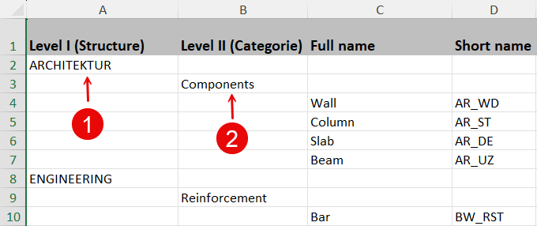
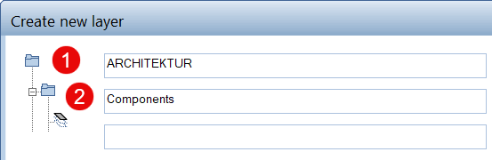
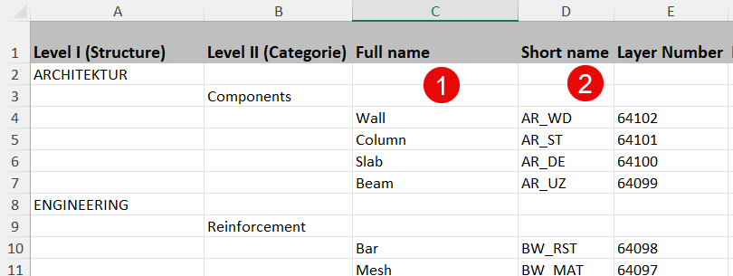
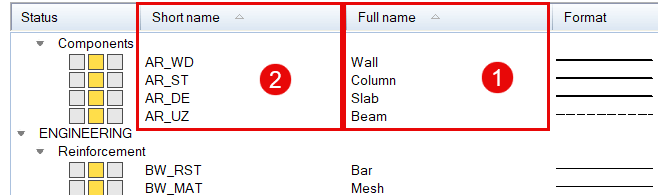
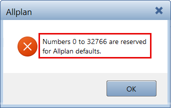
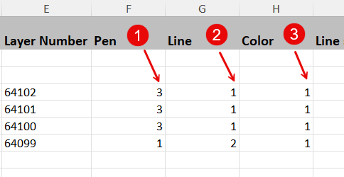
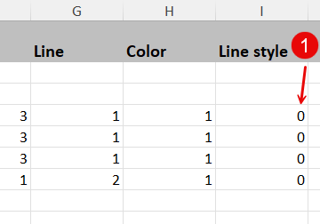
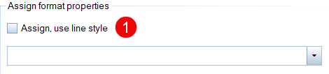

# PythonPart LayerHandling
The PythonPart enables the creation and editing of the ALLPLAN internal Layerfile **layerdef.dat** directly in Excel and can be used in different ways:
- **Creating** a new layer file from an external template
- **Exporting** and **Editing** an existing layer file
- **(Re)Import** of a layer file modified in Excel

The Excel file used for this purpose has to follow the provided schema to make sure that the PythonPart can read it when executed.

## Installation
The PythonPart **LayerHandling** can be installed directly from the Plugin Manager in ALLPLAN. 

Alternatively, the corresponding ***.allep** package can be downloaded from the [release page](https://github.com/AnkeNiedermaier/layer-handling-public/releases). ***.allep** files are ALLPLAN internal setups that can be installed via drag and drop into the program window.

At least the version 2026 is needed to install the PythonPart.

## Installed PythonPart Scripts
If the installation was successfull, the PythonPart **LayerHandling.pyp** as well as the Ecxel schema template **Schema_LayerHandling.xlsx** can be found
in the ALLPLAN Library:
`Office` → `ALLPLAN GmbH` → `LayerHandling`

## Preparation
If the PythonPart should be used to create a new layer file directly from an external template, it is necessary to fill the Excel template in advance with all necessary information. Like it is the case in the ALLPLAN layer file, the template is divided into individual columns:
- Level I (structure)
- Level II (categorie)
- Full name
- short name
- Layer number
- Pen
- Line
- Color
- Line style

Their heading and order is mandatory and should NOT be changed!\
The same applies for previously exported data that is edited in the Excel template prior to a re-import.
## Syntax of the Excel template
The schema of the Excel file is similar to the structure of the ALLPLAN layer file and contains a separate column for all required information that an individual layer in ALLPLAN could have:
- **Structure** and **Categorie**\
corresponding to the **Layer Levels I** and **II** inside a layer structure and can have any user-defied name

<!--  -->
\

- **Full name** and **Short name**\
corresponding to the compound name of an ALLPLAN layer in which the **Full name** is free of choice. The **Short name** on the other hand, as it is used as a kind of idetifier, must be **unique** and can therefor only occur once in each layer structure. All the other internal requirements, like capital letters and the number of characters, are checked from the PythonPart and directly corrected if necessary

\

- **Layer Number**\
is usaully assigned automatically when creating a new layer in ALLPLAN. Besides the Short name, the Number is the second **unique** indentifier and can therefor also only exist once in every layer structure.\
For user defined layers the **number range 65000-35000** is provided inside the program, in which the numbering should be consecutive if possible and in a DESCENDING order

- **Pen, Line and Color**\
comply with the possible requirements for the "byLayer" formating in the **Format Definition** tab. The **internal ALLPLAN number** is required here as specification, that can be determined in the corresponding Format pulldowns of the Properties palette for example

- **Line style**\
can be used as a dynamic specification for the "byLayer" **formating** and is also entered in using the **internal ALLPLAN number**. If no Linestyle should be assigned to a layer, the number 0 has to be entered in the corresponding column

\

## Workflow
The PythonPart is executed directly in ALLPLAN from the **Library palette**. In general, all PythonParts can be stated either with a **double-click** on the entry or per **Drag and Drop**. This shows the corresponding Properties palette and executes the skript.\
Similar to the possible functionality the palette contains two parts:
- to export a Layer file to Excel
- to create a Layer file from Excel

The **Search...** button is used to select the required file from which the data should be read or to which the data should be written. If a  Layer file is generated, it is also possible to create a **new file**. Both workflows can be executed separatelly and independend.\
If a new created Layer file should be read automatically in ALLPLAN, it must have the name **layerdef.dat** and depending on the ressource settings stored directly in the corresponding subfolder Std or Prj. Alternatively, it is also possible to read the file via the **layer dialog** and the tab **Layer Structures**.

## Video

<!--  -->

<video width="320" height="240" controls>
  <source src="./docs/PP_LayerHandling.mp4" type="video/mp4">
</video>
